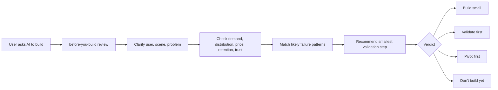

# Before You Build Skill

[](LICENSE)
[](https://github.com/bin1874/before-you-build-skill/releases)
[](https://github.com/bin1874/before-you-build-skill/stargazers)
[](https://beforeyoubuild.fyi/en/skill)

Don't ask AI to build it yet. Ask why it might fail first.

Before You Build Skill is a lightweight open-source skill package for AI coding tools. Use it before starting a product, adding a feature, expanding scope, or asking an agent to implement an idea.

It does not build your app. It makes the agent pause and review product risk first.

## At A Glance

| Field | Details |
|---|---|
| Best for | Product ideas, AI app ideas, SaaS ideas, side projects, feature requests, requirement changes |
| Primary users | Indie hackers, solo founders, product engineers, AI builders, small teams |
| Main output | A short pre-build risk review and verdict |
| Verdicts | `Build small`, `Validate first`, `Pivot first`, `Don't build yet` |
| API key | Not required for normal use |
| Optional data | Before You Build Case Memory, only when the user allows it |

## Why This Exists

AI coding agents made building much faster. That also makes it easier to spend days or weeks polishing the wrong thing.

This skill adds a simple pre-build review step. Before the agent writes code, it should challenge the riskiest assumptions: who needs this, why now, what they use today, whether they would pay, and what would make the idea fail.

## Who Should Use It

- Indie hackers and solo founders testing new product ideas.
- AI SaaS builders turning demos into products.
- Product engineers adding features to existing products.
- Teams using Codex, Claude Code, Cursor, OpenCode, OpenClaw, or similar coding agents.
- Teams using Hermes, Gemini CLI, and other tools that can load local skills, rules, or slash commands.
- Anyone tempted to ask an agent to implement before the demand risk is clear.

## Compatible Tools

| Tool | Recommended setup |
|---|---|
| Codex | Install the repository as a local skill folder when local skills are available. |
| Claude Code | Use as a Claude Code skill or copy `SKILL.md` into project instructions. |
| Cursor | Add `SKILL.md` as a project rule, then invoke it before implementation. |
| OpenClaw | Use OpenClaw's native Git install or the `npx` local installer. See [docs/OPENCLAW.md](docs/OPENCLAW.md). |
| Hermes | Install the repository as a local skill under `~/.hermes/skills/`. |
| Gemini CLI | Install a custom slash command plus a local skill reference. |
| Other agents | Paste the minimal prompt from [docs/INSTALL.md](docs/INSTALL.md). |

## What It Does

- Reviews product and feature ideas before implementation.
- Challenges demand, distribution, pricing, retention, trust, and workflow assumptions.
- Matches common failure patterns such as thin wrappers, low-frequency needs, platform dependency, and subscription mismatch.
- Suggests the smallest useful validation step before coding.
- Can optionally query Before You Build Case Memory for similar public cases.

## How It Works



## When To Use It

Use it before:

- building a new SaaS, AI app, side project, or startup idea;
- adding a new feature to an existing product;
- copying a competitor feature;
- expanding a prototype into a platform;
- asking an AI coding agent to build before the riskiest assumption is clear.

Do not use it as a replacement for technical review, security review, architecture review, or code review. This skill is about whether the product or feature should be built, not how to implement it.

## Quick Start

Copy this into your AI coding tool:

```text
Use before-you-build to review this idea before implementation:

[Describe the product, feature, target users, current alternatives, and why you think it should exist.]
```

The agent should return a short reality check with a verdict before it starts implementation.

## Package Contents

```text
.
- SKILL.md
- CONTRIBUTING.md
- package.json
- .clawhubignore
- agents/
  - openai.yaml
- bin/
  - before-you-build-skill.mjs
- .github/
  - ISSUE_TEMPLATE/
  - DISCUSSION_TEMPLATE/
- references/
  - case-memory-api.md
  - evidence-check.md
  - failure-patterns.md
- examples/
  - feature-change.md
  - launched-project.md
  - new-product-idea.md
- docs/
  - INSTALL.md
  - OPENCLAW.md
  - PROMOTION.md
```

## Install

### One-command install

Use the npm installer when you want the package copied into a local tool directory:

```bash
npx before-you-build-skill install codex
npx before-you-build-skill install claude
npx before-you-build-skill install cursor --path /path/to/project
npx before-you-build-skill install openclaw
npx before-you-build-skill install hermes
npx before-you-build-skill install gemini
```

To install local adapters for every supported target:

```bash
npx before-you-build-skill install all
```

The installer is a convenience wrapper. Some tools also have native installation flows. For example, OpenClaw can install directly from Git:

```bash
openclaw skills install git:bin1874/before-you-build-skill@main --as before-you-build
```

### Manual install

Clone or download this repository, then add the whole folder to your AI coding tool's skill, agent, or custom instruction location.

```bash
git clone https://github.com/bin1874/before-you-build-skill.git
```

For tools that do not support skill folders, open `SKILL.md` and paste the relevant instructions into your project rules or custom instructions.

See [docs/INSTALL.md](docs/INSTALL.md) for tool-specific setup notes.

For OpenClaw and ClawHub-specific publishing notes, see [docs/OPENCLAW.md](docs/OPENCLAW.md).

## Install Paths

| Setup | What to do |
|---|---|
| `npx` installer | Run `npx before-you-build-skill install <target>`. |
| Full skill package | Clone this repo and add the whole folder to your tool's skill directory. |
| Project-level rule | Copy `SKILL.md` into your project rules or instruction file. |
| Prompt-only | Use the minimal prompt in [docs/INSTALL.md](docs/INSTALL.md#minimal-prompt-only-setup). |
| Optional Case Memory | Use [references/case-memory-api.md](references/case-memory-api.md) only after user permission. |

## `npx` Targets

| Target | Installed files |
|---|---|
| `codex` | `~/.codex/skills/before-you-build/` |
| `claude` | `~/.claude/skills/before-you-build/` |
| `cursor` | `<project>/.cursor/rules/before-you-build.md` |
| `openclaw` | `~/.openclaw/skills/before-you-build/` |
| `hermes` | `~/.hermes/skills/before-you-build/` |
| `gemini` | `~/.gemini/commands/before-you-build.toml` and `~/.gemini/skills/before-you-build/` |

## Basic Usage

Start a request with:

```text
before you build: I want to build an AI tool that...
```

Or:

```text
Use before-you-build to review this feature before I implement it:
...
```

The skill should return a short reality check, usually with:

- what you want to build;
- the biggest risk;
- likely failure patterns;
- validation steps;
- a recommendation: `Build small`, `Validate first`, `Pivot first`, or `Don't build yet`.

## Examples

| Scenario | Example |
|---|---|
| New product idea | [AI podcast-to-LinkedIn tool](examples/new-product-idea.md) |
| Feature change | [Team workspaces and roles](examples/feature-change.md) |
| Launched project | [AI resume checker with traffic but low payment](examples/launched-project.md) |
| Real public case | [Dripfit: AI outfit assistant risk review](examples/real-case-dripfit.md) |
| Real public case | [GummySearch: Reddit research workflow and platform risk](examples/real-case-gummysearch.md) |
| Real public case | [Ledger Cloud Reminders: developer tool adoption risk](examples/real-case-ledger-cloud-reminders.md) |

## Example

Input:

```text
before you build: I want to build an AI tool that summarizes meeting recordings for freelancers.
```

Expected shape:

```markdown
## Quick Reality Check

What you want to build:
- An AI meeting summary tool for freelancers.

Biggest risk:
- The problem may be too low-frequency or already solved well enough by existing meeting tools.

Failure patterns:
- Free alternative is good enough
- Subscription mismatch
- Tool without workflow

Validate before building:
1. Find 10 freelancers who record more than 5 client meetings per month.
2. Ask what they currently use and what is painful enough to pay for.
3. Manually summarize 3 real recordings and ask for payment before automating.

Recommendation:
Validate first
```

## Case Memory

Normal use does not require an API key.

The skill can optionally query the public Before You Build Case Memory API when a compatible agent or integration is available. Before doing that, it should ask for user permission unless the user already asked to use the case database.

Case Memory endpoint:

```text
POST https://api.beforeyoubuild.fyi/api/v1/case-memory/search
```

The endpoint is used to retrieve similar public product cases from [Before You Build](https://beforeyoubuild.fyi). It is not required for the core skill to work.

## Privacy Boundary

Do not send secrets, customer names, private financials, credentials, private user data, or unreleased confidential details to any remote endpoint.

If Case Memory is used, send only a short idea summary and the minimum fields needed to find similar public cases.

## Community

Use GitHub issues or discussions for:

- testing the skill against a real product or feature idea;
- suggesting a failure pattern that should be added;
- reporting confusing output from an agent;
- asking for compatibility notes for another AI coding tool.

Useful templates are included under `.github/ISSUE_TEMPLATE/` and `.github/DISCUSSION_TEMPLATE/`.

See [CONTRIBUTING.md](CONTRIBUTING.md) before opening a pull request.

## Website

- Product risk case library: [beforeyoubuild.fyi](https://beforeyoubuild.fyi)
- Skill page: [beforeyoubuild.fyi/en/skill](https://beforeyoubuild.fyi/en/skill)

## Share

If you want to share this project, start with the core idea:

> AI coding agents made building easier. Before you ask one to build, ask why the idea might fail.

More copy, directory notes, and community posting angles are in [docs/PROMOTION.md](docs/PROMOTION.md).

## License

MIT
